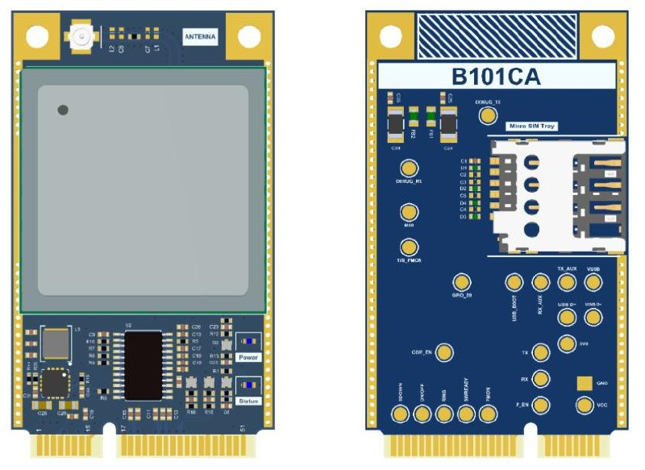

# B101BA-PCIe

B101BA-PCIe is a Mini PCI Express form-factor cellular modem card built around the **Telit LE910C1-EUX** 4G modem. The design exposes power, UART, USB, SPI, I2C, analog and GPIO signals through the Mini PCIe edge connector and includes the supporting power, level shifting, SIM and RF circuitry required to operate the modem as an embedded communication module.

This repository is an **Altium Designer hardware design repository**. It contains the project files, schematics, PCB layout and generated outputs used to review, manufacture or extend the board.

## What This Board Is

From the schematic set, B101BA-PCIe is designed as a **qSlot IoT 4G modem card** in Mini PCIe format. In practical terms, it is a compact cellular communication module intended to be plugged into a host system through a Mini PCI Express connector while exposing a set of embedded control and data interfaces.

At a high level, the board provides:

- a **Telit LE910C1-EUX LTE modem**
- a **Mini PCIe edge connector** as the host interface
- a dedicated **3.8 V modem power rail** generated from the host supply
- **1.8 V ↔ 3.3 V level translation** for modem control and communication lines
- a **SIM card interface**
- a **cellular RF matching and antenna connection**
- modem control signals such as **ON/OFF**, **shutdown**, **PWRMON**, **SWREADY** and **RING**
- access to **UART, USB, I2C, SPI, GPIO and analog pins** exposed by the modem/connector scheme

## Main Functional Blocks

The schematic set is structured around a small number of clearly separated hardware blocks:

### 1. Modem Core
The main modem is the **LE910C1-EUX** from Telit. The schematic pages show the modem broken into functional units such as power, UART, control, USB, GNSS and unused pins.

### 2. Host Interface
The host side uses a **52-pin Mini PCI Express edge connector**. The connector mapping exposes:

- multiple **3.3 V power feeds**
- **USB D+ / D-**
- **UART0 / UART1**
- **I2C**
- **SPI**
- PWM, analog and GPIO-style lines
- modem enable / communication control signals

This makes the board suitable as a host-pluggable communication card rather than a self-contained end product.

### 3. 3.8 V Modem Power Supply
A dedicated **TPS62130** buck regulator is used to generate the modem supply rail. The schematics show the 3.8 V rail sizing and the surrounding bulk capacitance required for modem current transients.

This is an important design detail because LTE modems are sensitive to supply integrity during attach/transmit bursts.

### 4. Voltage Translation
The LE910C1 signal and control lines operate at **1.8 V**, while the host side is routed at **3.3 V**. The design uses an **SN74AXC8T245** translator to bridge those domains safely.

This block is critical because it avoids back-powering the modem and makes the host-facing signals easier to integrate into typical 3.3 V embedded systems.

### 5. Modem Control Logic
Discrete transistor-based control is used for hardware signals such as:

- **ON/OFF**
- **hardware shutdown**

These circuits follow the modem vendor’s recommendations regarding open-collector style control and power sequencing constraints.

### 6. RF Section
The cellular antenna path includes:

- RF matching components
- controlled-impedance routing notes
- an **IPEX / MHF** style RF connector

The schematic also shows GNSS-related modem pins in the unused / auxiliary pages, indicating room for further functionality depending on the final integration strategy.

## Repository Structure

This repository is not a firmware project. It is primarily a hardware design source tree.

| Path | Purpose |
|---|---|
| `B101BA.PrjPcb` | Main Altium project file |
| `B101BA.PcbDoc` | PCB layout document |
| `Schematics/` | Schematic source files |
| `B101BA.BomDoc` | Bill of materials document |
| `Job File.OutJob` | Output / fabrication generation settings |
| `Output/` | Generated outputs such as prints or manufacturing artifacts |
| `History/` | Altium history / revision artifacts |
| `B101BA.PCBDwf` | PCB documentation/export artifact |

## Schematic Set Overview

The published schematic output shows the project split into pages such as:

- GSM IoT Block Diagram
- Card Edge Connector
- 3V8 Power Regulator
- Voltage Translator
- Control Signals
- GSM Antenna & Match Circuit
- Unused Modem Pins

This structure makes the design relatively easy to review from a functional-block perspective.

## Intended Use

B101BA-PCIe appears suited for projects that need a pluggable cellular modem subsystem in an embedded or industrial design. Likely use cases include:

- IoT gateways
- industrial controllers
- telemetry units
- remote monitoring systems
- host systems that need LTE connectivity through a modular interface

## Tooling Requirements

To inspect and modify the project properly, the recommended tooling is:

- **Altium Designer** for native project editing
- a Gerber/CAM viewer for production output review
- PDF review tools for schematic print inspection

## Notes for Contributors and Reviewers

- This repository currently behaves like a **hardware source repository**, not a fully packaged open hardware release.
- The project naming is centered around **B101BA**, while the repository name is **B101**. Keeping naming consistent across README, release artifacts and public pages would make the project clearer to outside readers.
- The design files are already useful for technical review, but the repository will become significantly stronger with:
  - board photos or renders
  - fabrication output explanation
  - license clarification
  - revision history notes
  - a short “design intent / constraints” section

## Project Page

Project page:

<https://www.akkoyun.net/acik-kaynak/B101BA-PCIe>

## License

A repository-level license file is not currently visible from the public metadata. If this project is intended to be openly reusable, adding an explicit `LICENSE` file is recommended.
