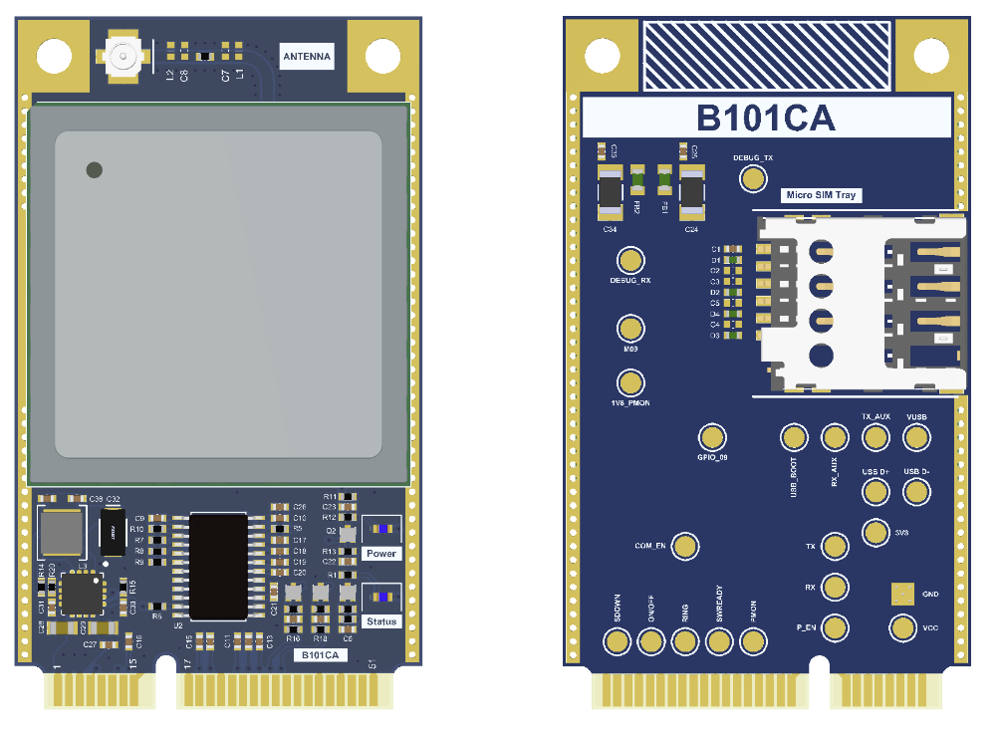

# B101BA-PCIe

**B101BA-PCIe** is a Mini PCI Express form-factor cellular modem card based on the **Telit LE910C1-EUX** 4G modem. This repository contains all Altium Designer project files, schematics, PCB layout, and generated outputs for review, manufacturing, and further development.

## Features

- Telit LE910C1-EUX LTE modem
- Mini PCIe edge connector (host interface)
- Dedicated 3.8V modem power rail (TPS62130)
- 1.8V ↔ 3.3V level translation (SN74AXC8T245)
- SIM card interface
- Cellular RF matching and antenna connection (IPEX/MHF)
- Exposed UART, USB, I2C, SPI, GPIO, analog pins
- Modem control signals: ON/OFF, shutdown, PWRMON, SWREADY, RING

## Block Diagram

- **Modem Core:** LE910C1-EUX, separated by function (power, UART, USB, GNSS, etc.)
- **Host Interface:** 52-pin Mini PCIe, multiple power/data/control lines
- **Power Supply:** 3.8V buck regulator, bulk capacitance for LTE current bursts
- **Voltage Translation:** Safe bridging between 1.8V (modem) and 3.3V (host)
- **Control Logic:** Discrete transistor-based ON/OFF and shutdown
- **RF Section:** Matching, controlled impedance, IPEX/MHF connector

## Repository Structure

| Path                        | Purpose                                 |
|-----------------------------|-----------------------------------------|
| `B101BA.PrjPcb`             | Main Altium project file                |
| `B101BA.PcbDoc`             | PCB layout document                     |
| `Schematics/`               | Schematic source files                  |
| `B101BA.BomDoc`             | Bill of materials document              |
| `Job File.OutJob`           | Output/fabrication generation settings  |
| `Output/`                   | Generated outputs (prints, manufacturing)|
| `History/`                  | Altium history/revision artifacts       |
| `B101BA.PCBDwf`             | PCB documentation/export artifact       |

## Schematic Pages

- GSM IoT Block Diagram
- Card Edge Connector
- 3V8 Power Regulator
- Voltage Translator
- Control Signals
- GSM Antenna & Match Circuit
- Unused Modem Pins

## Typical Applications

- IoT gateways
- Industrial controllers
- Telemetry units
- Remote monitoring systems
- Any host system needing modular LTE connectivity

## Tooling

- Altium Designer (project editing)
- Gerber/CAM viewer (output review)
- PDF viewer (schematic prints)

## Version History

| Version   | Date       | Description                                      |
|-----------|------------|--------------------------------------------------|
| 00.00.01  | 2026-02-18 | Initial draft, basic schematic and PCB           |
| 00.00.02  | 2026-02-26 | Design revision, bug fixes, DRC updates          |
| 00.00.03  | 2026-04-23 | Post Design Review 01 updates, output refreshed  |

## Design Reviews & Documentation

- **Design Review 01:** Held on 2026-04-23. See `docs/Design Review 01/` for reviewed files and notes:
  - [BOM and review notes](docs/Design%20Review%2001/B101BA_00.00.01_BOM.csv)
  - [Design review presentation](docs/Design%20Review%2001/Telit%20Design%20Review%2001%20(Schematic%20%26%20PCB).pages)
- All manufacturing and review outputs: see `Output/` directory.

---

## Project Page

<https://www.akkoyun.net/acik-kaynak/B101BA-PCIe>

## License

A repository-level license file is not currently visible. If this project is intended to be openly reusable, please add a `LICENSE` file.
